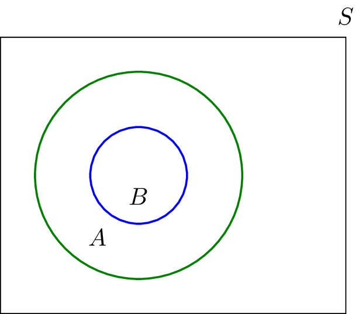
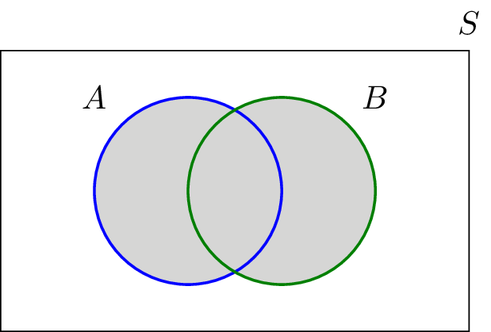
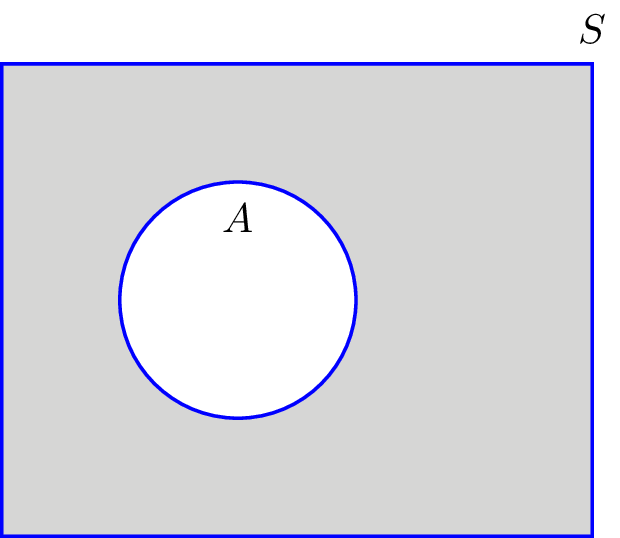
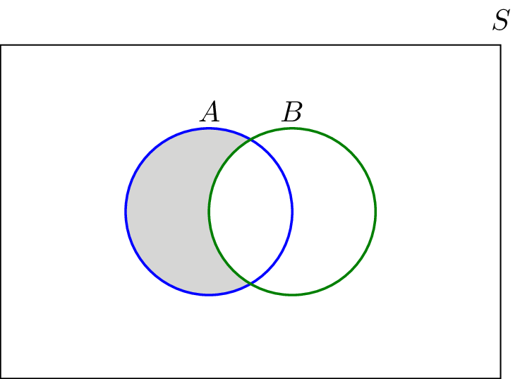
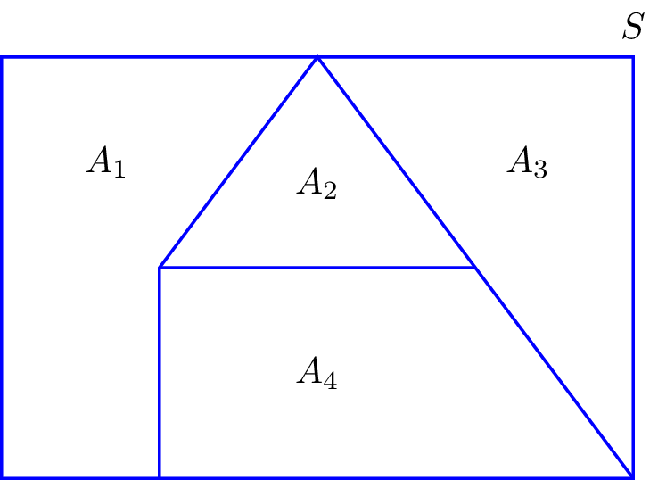

## 1.2.0 Review

\
\
A __set__ is a collection of some items (elements). Ordering of the set does not matter!

"Heads element belongs to the set A"
$$heads \in A$$
"A is a set that contains elements heads and tails"
$$A = \{heads, \ tails\}$$

* The set of natural numbers ${N}=\{1,2,3,\cdots\}$
* The set of Integers ${Z}=\{\cdots,-3,-2,-1,0,1,2,3,\cdots\}$
* The set of rational numbers ${Q}$
* The set of real numbers ${R}$
* Closed interval on the real line. For instance, $[2,\ 3]$ is a set of all
real numbers $x$ such that $2 \leq x \leq 3$.
* Open interval on the real line. For instance $(-1,\ 3)$ is the set of all real numbers 
$x$ such that $-1 < x < 3$
* It is also possible to have a mix: $[1, 2)$ translates to $1 \leq x < 2$.

\

We can also define a set by mathematically stating the properties satisfied by the elements in the set. In particular, we may write 

$$A=\{x : x \textrm{ satisfies some property} \}$$
or
$$ A=\{x : x \textrm{ satisfies some property} \}$$
The symbols "|" and ":" are pronounced "such that." 
\

* If the set $D$ is defined as $D = \{x^2|x \in {N} \}$, then $D = \{1, 4, 9, 16, ...\}$. In normal words: $D$ is a set that consists of all second powers of all natural ${N}$ numbers.
* If the set $C$ is defined as $C = \{ x | x \in {Z}, -2 \leq x < 10 \}$, then $C = \{-2, -1, 0, ..., 9 \}$

Set $A$ is a **subset** of set $B$ if every element of $A$ is also an element of $B$. We write $A \subset B$. Equivalently, we say $B$ is a **superset** of $A$, expressed as $B \supset A$.
\
If $E = \{1, 4 \}$ and $C = \{1,4,9\}$, then $E \subset C$ and $C \supset E$

* A set $A$ is a __superset__ ($\supset$) of set $B$ when all elements of set $B$ are elements of set $A$.
* A set $B$ is a __subset__ ($\subset$) of set $A$ when all elements of set $B$ are elements of set $A$.

Another example is ${N} \subset {Z}$ because all natural numbers are all also real numbers. 

---

Two sets are __equal__ if both have the exact same elements. Thus, $A = B$ if $A \subset B$ and $B \subset A$.
\
The set with no elements, $\emptyset = \{ \}$ is the __null set__ or __empty set__. For any set $A$, $\emptyset \subset A$. Which is kind of weird. Basically you are saying, "A set with no elements is part of set $A$."

\

The __Universal set__ is the set of all things that we could possibly consider in the context we are studying. We often denote the universal set with $S$. In the language of probability theory, the universal set is the __sample space__.

\

For instance, when discussing the rolling of a die, our universal set may be defined as $S = \{ 1, 2, 3, 4, 5, 6 \}$. 

---

## 1.2.1 Venn Diagrams

A Venn diagram is a useful way to visualize the relation between two sets. In the Venn diagram, any set is depicted as a closed region within a universal set. 

The above Venn Diagram shows how two sets $A$ and $B$ are related, as $B$ is a subset of $A$, $B \subset A$; or differently put, $A$ is a superset of $B$, $A \supset B$. However, $B$ is not a superset of $A$ as $A$ is not a subset of $B$. Hence $B \not \supset A$.

---

## 1.2.2 Set Operations
The __union__ of two sets is a set containing all elements that are in $A$ or $B$ (possibly both, but not necessarily).
\
For instance, $\{1, 2\} \cup \{2, 3\} = \{1, 2, 3\}$. As you can see, 1 and 3 are part of the union even though they are not present in both sets. We can write that a value $x$ is in the union of $A$ and $B$, $x \in (A \cup B)$ if either $x \in A$ or $x \in B$. 

\

Note that $A \cup B = B \cup A$, there is no sense to think there is a right or wrong order because union represents overlap.

A union can be of more than just two sets. This can be written compactly as follows

$$\bigcup_{i=1}^{n} A_i.$$

Where $A_i$ represents each set identifier in $n$ number of sets from $1,..., n$.

\

For instance, if $A_1 = \{a,b,c\}, A_2 = \{a,d\}, A_3 = \{a,d\}$ then $A_1 \cup A_2 \cup A_3 = \{a, b, c, h, d \}$.

\

The __intersection__ of two sets $A$ and $B$ is denoted as $A \cap B$, consists of all elements that are both in $A$ and in $B$.

\

The __Complement__ of set $A$, denoted by $A^{c}$ or $\bar{A}$, is the set of elements that are in the universal set $S$ but not in $A$. 

The __difference__ is defined as: The set $A - B$ consists of elements that are in $A$ but not in $B$. $A = \{1, 2, 3\}$ and $B = \{3, 5\}$, then $A - B = \{1, 2\}$. Because $3$ was part of $B$ and also $A$, it was taken away from $A$. 

It looks as follows:

\

Two sets $A$ and $B$ are __mutually exclusive__ or __disjoint__ when they have no shared elements. Their intersection is the empty set, $A \cap B = \emptyset$. 

\

A collection of nonempty sets $A_1$, $A_2$, ... is a __partition__ of set $A$ if...

* They are disjoint. 
* Their union is $A$.

It basically means that $A$ consists of all elements in $A_1$ and $A_2$ without them having any overlap between one another.

---

__Theorem: De Morgan's Law__
\

* _Not_($A$ and $B$) is the same as _Not_ $A$ or _Not_ $B$. I.e., $\overline{A \cup B} = \bar{A} \cap \bar{B}$
* _Not_($A$ or $B$) is the same as _Not_ $A$ and _Not_ $B$. I.e., $\overline{A \cap B} = \bar{A} \cup \bar{B}$

The __complement__ of the __union__ of two sets is equal to the __intersection__ of their __complement__. Also, the __complement__ of the intersection of two sets is equal to the __union__ of their complements. 

Watch video: https://www.youtube.com/watch?v=LBGbwQDhceg

__Proof: $(\overline{A \cup B}) = \bar{A} \cap \bar {B}$__

* $x \in (\overline{A \cup B})$, if we create a space that is made up of two areas that can be either part of $A$ or $B$, $x$ can be whatever is outside of this space.
* $x \notin (A \cup B)$, if we create a space that is made up of of two areas that can be part of $A$ or $B$, $x$ can never be inside of this space.
* $x \notin A$ and $x \notin B$, $x$ is not part of $A$ and $x$ is not part of $B$. 
* $x \in \bar{A}$ and $x \in \bar{B}$, $x$ is part of the area outside of $A$ and also part of the area outside of $B$.
* $x \in \bar{A} \cap \bar{B}$, $x$ is part of outside $A$ and outside $B$. 

Imagine if you do two applications ($A$ and $B$). Both have a probability that you will get an offer. You can say two things:

* $P(\overline{A \cup B})$: The probability that you will not get job A or job B.
* $P(\bar{A} \cap \bar{B})$: The probability that you will not get both job A and job B. 

__Proof: $\overline{A \cap B} = \bar{A} \cup \bar{B}$__

* $x \in (\overline{A \cap B})$
* $x \notin (A \cap B)$
* $x \notin A$ or $x \notin B$
* $x \in \bar{A}$ or $x \in \bar{B}$
* $x \in \bar{A} \cup \bar{B}$

---

It can also be expressed in more Computer Science terms

* Not($A$ and $B$) $\rightarrow$ Not $A$ or not $B$
* Not ($A$ or $B$) $\rightarrow$ Not $A$ and Not $B$
* Not($A$ and $B$) $\neq$ Not $A$ and Not $B$.

It's like making a selection in SQL where you want certain exclusions. 
* ID is not in ($A$ and $B$) is the same as saying ID is not in $A$ or $B$.

---

__Theorem 1.2.: Distributive law__

For any sets $A$, $B$, $C$ we have:

* $A \cap (B \cup C) = (A \cap B) \cup (A \cap C)$;
* $A \cup (B \cap C) = (A \cup B) \cap (A \cup C)$.

Which pretty easily makes sense if you just draw it out on a Venn with three circles for each set.

---

__Ordered pairs (a, b)__
Sometimes, order matters. For sets, order does not matter really. but for pairs, order does. However, there is an obvious case when it doesnt: $(a, b) = (c,d)$ if $b=d$.

A __Cartesian product__  of two sets $A$ and $B$, written as $A \times  B$, is the set containing __ordered__ pairs (x, y) such that $x \in A$ and $y \in B$. 

For instance, if $A = \{1, 2\}$ and $B = \{3, 4, 5,\}$, then the Cartesian product of $A$ and $B$ is $\{(1,3),(1,4),(1,5),(2,3),(2,4),(2,5)\}$. As you can see, all the elements in the front spot of the pair ($a$) are part of the set $A$. All of the elements of the back spot of each pair ($b$) are in $B$. 

If $C = A \times B$, then each element of $C$, a.k.a. the Cartesian product, is of the form $(x,y)$, where $x \in A$ and $y \in B$. 

$$A \times B = \{(x, y) | x \in A \ and \ y \in B\}$$
In other words, The Cartesian product of $A$ and $B$, such that $x$ is part of $A$ and $y$ is part of $B$. 

For example, $A = \{1,2,3\}$ and $B = \{H,T\}$, then:
$$A \times B = \{(1, H), (1, T), (2, H), (2, T), (3, H), (4, T)\}$$

Note that here the pairs are ordered, so for example, $(1, H) \neq (H, 1)$. Thus, $A \times B$ is not the same as $B \times A$! 

\

__Multiplication principle__

If you have two finite sets $A$ and $B$, where $A$ has $M$ elements and $B$ has $N$ elements, then $A \times B$ has $M \times N$ elements. In the previous example, $M=3$ and $N = 2$, as we can see, we ended up with 6 pairs.

The number of elements in a set is denoted as $|A|$. So we can write $|A| = M = 3$, $|B| = N = 2$, $|A \times B| = MN$. 

We can also define the Cartesian product of _n_ sets $A_1$, $A_2$,...,$A_n$ as 
$$A_1 \times A_2 \times A_3 \times, ..., A_n = \{(x_1, x_2,...,x_n) \  | \ x_1 \in A_1 \ and \  x_2 \in A_2 \ and \ ... x_n \in A_n\}$$

---

## 1.2.3 Cardinality: Countable and Uncountable

The __cardinality__ of a set is basically the size of the set. The cardinality of a set is denoted by $|A|$. Definition: The number of elements in a set of other grouping, as a property of that grouping. A.k.a, The number of elements in a given mathematical set.

\

__Finite sets:__
Consider set $A$. If $A$ has a finite number of elements, its cardinality is simply the number elements in $A$. For instance, $A = \{2, 4, 6, 8, 10\}$, then $|A| = 5$. 

The __inclusion-exclusion principle__. For two finite sets $A$ and $B$, we have:
$$ |A \cup B| = |A| + |B| - |A \cap B|$$

This makes sense because $|A \cup B|$ is basically one intersection + what else is left of $A$ and $B$. $|A| + |B|$ would actually give us two intersections (tip, draw it out and you will see). Hence, we take away one intersection with the final part: $- |A \cap B|$.

This also holds for:
$$|A \cup B \cup C| = |A| + |B| + |C| - |A \cup B| - |A \cup C| - |B \cup C| + |A \cap B \cap C|$$

In this case, we actually took one too many of the tri-inner section off and need to add it back on. Hence, $+ |A \cap B \cap C|$. 

\

We can notice a pattern, as we added a set to the equation $|C|$, we had to subtract and add more stuff compared to before, where we didn't need to even add anything in the first place. So how do we express this?

Generally, for _n_ finite sets $A_1$, $A_2$, $A_3$, ..., $A_n$, we can write. 
$$\biggl|\bigcup_{i=1}^n A_i\biggr|=\sum_{i=1}^n\left|A_i\right|-\sum_{i < j}\left|A_i\cap A_j\right|+\sum_{i < j < k}\left|A_i\cap A_j\cap A_k\right|-\ \cdots\ + \left(-1\right)^{n+1} \left|A_1\cap\cdots\cap A_n\right|$$

In normal language: For finite sets $A_1$ through $A_n$,
$$\biggl|\bigcup_{i=1}^n A_i\biggr|$$

we would first need to sum up all cardinalities of all sets $|A_{i,n}|$, hence: $$\sum_{i=1}^n\left|A_i\right|$$

Next, we need to add the intersections that we took out too much, just like in the previous example. 

---

### Exercise

* There are 10 people with white shirts and 8 people with red shirts;
* 4 people have black shoes and white shirts;
* 3 people have black shoes and red shirts;
* the total number of people with white or red shirts or black shoes is 21

Available information.

* $|W| = 10$
* $|R| = 8$
* $|W \cap B| = 4$
* $|R \cap B| = 3$
* $|W \cup B \cup R| = 21$

$W$ and $R$ are __disjoint__, $|W \cap R| = 0$. Thus, by applying the inclusion-exclusion principle, we obtain:
$$|W \cup R \cup B| = |W| + |R| + |B| - |W \cap R| - |W \cap B| - |R \cap B| + |W \cap R \cap B|$$
$$= 10 + 8 + |B| - 0 - 4 - 3 + 0$$

Answer: |B| = 10. 

\

Why was $|W \cap R \cap B|$ equal to $0$? Because there is no intersect possible between red and white shirts. 

---

__Infinite Sets:__
What if $A$ is an infitnite set? (I'm going to skip this one today.

## 1.2.4 Functions

A function $f$ is a rule that takes an input from a specific set, called the __domain__, and produces an output from another set, called __co-domain__. Thus, a function _maps_ elements from the domain set to element in the co-domain with the property that each input is mapped to exactly one output. For a function $f$, if $x$ is an element in the domain, then the function value (output of the function) is shown by $f(x)$. If $A$ is the domain and $B$ is the co-domain for function $f$, we use the notation:
$$f: A \rightarrow B$$

Example, consider the function $f: \mathbb{R} \rightarrow \mathbb{R}$, defined as $f(x) = x^2$. This function takes any real number $x$ and outputs $x^2$. For example, $f(2) = 4$.

Consider the function $g: \{H,T\} \rightarrow \{0, 1\}$ is defined as $g(H) = 0$ and $g(T) = 1$. This function can only take two possible inputs, $H$ or $T$, where $H$ is mapped to $0$ and $T$ is mapped to $1$. 

---

To summarize
* What can go __into__ a function is called the __Domain__
* What can __possibly come out__ of a function is called the __Co-domain__
* The set of elements that get pointed to in $B$ (the actual values produced by the function) are the __Range__, also called the image.

__Example__
Let's say we have the following

* Function is $2x+1$
* Domain: $\{1, 2, 3, 4\}$
* Co-domain: $\{1,2,3,4,5,6,7,8,9,10\}$
* Range: $\{3,5,7,9\}$

The __domain__ is pretty important for a function even though it might not seem so at first. Changing the domain can pretty much change the function.

\

__Co-domain vs. Range__
The Co-domain and range are both on the output side, but are subtly different. 

The __Co-domain__ is the set of values that could __possibly__come out. The Co-domain is actually __part of the definition__ of the function. The Range is the set of values that actually __do__ come out.

__Example:__ If we define a function, $f(x)=2x$ with a domain and co-domain of integers (because we say so). But by thinking about it we can see that the range (actual output values) is just the __even__ integers. 

* So the co-domain is integers
* But the range is even integers.

## 1.2.5 Solved Problems: Review of Set Theory

__Problem 1__
Let $A$, $B$, $C$ be three sets as shown in the following Venn diagram. For each of the following sets, draw a Venn diagram.

